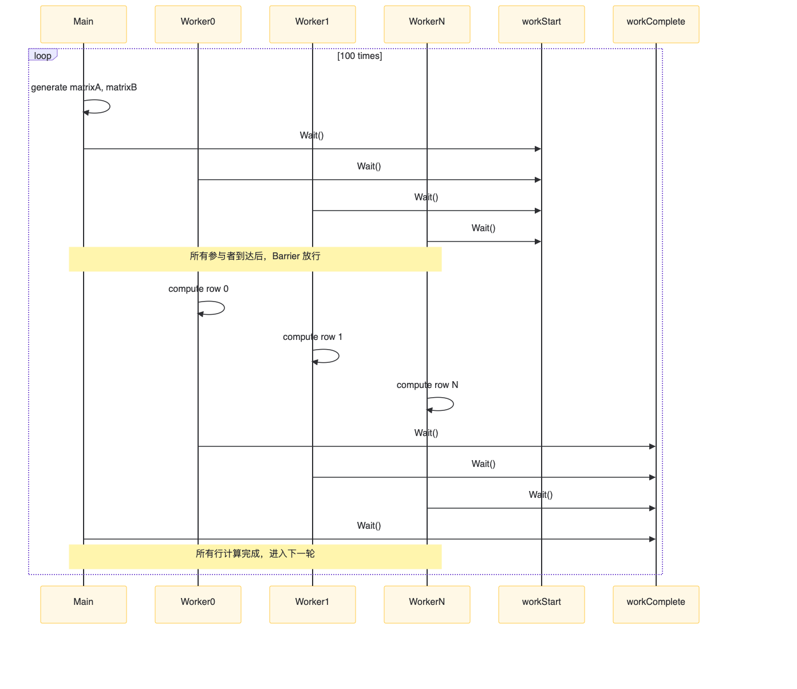

# 两个 Barrier 的作用

每一轮让所有 goroutine 同时开始计算并确保全部完成后再进入下一轮

# Barrier 大小为 matrixSize + 1

是因为除了 matrixSize 个 worker goroutine main 也是一个参与者进行矩阵生成的操作

# 关于main里生成矩阵的之后的两个wait

```
main          worker0        worker1 ... workerN
──gen──┐
│      wait           wait          wait
workStart.Wait() ——开闸——> compute ——> workComplete.Wait()
│                                   │
workComplete.Wait() <——开闸——< done        done
```

* 第一个 workStart.Wait() 把 main 阻塞住直到 所有 worker 也调用了 workStart.Wait() 此时大家同时越过起跑线
* 紧接着的 workComplete.Wait() 又把 main 阻塞住直到所有 worker 调用 workComplete.Wait() 此时大家同时越过终点线

# 🚪 闸门 1：workStart

## 作用：确保“所有人到齐后才一起开始计算”

|            时间点            |              正在发生的事               |
|:-------------------------:|:---------------------------------:|
|       main 生成完 A、B        | main 在 `workStart.Wait()` 处**堵住** |
|       250 个 worker        |  各自在 `workStart.Wait()` 处**堵住**   |
| 当第 251 个人（main + 250）全部到达 |       **闸门打开**，所有人**同时越过**        |
|            紧接着            |       250 个 worker 并行计算各自的行       |

# 🚪 闸门 2：workComplete

## 作用：确保“所有人都算完后才一起进入下一轮”

|       时间点        |             正在发生的事              |
|:----------------:|:-------------------------------:|
| 每个 worker 算完自己的行 | 在 `workComplete.Wait()` 处**堵住** |
|     main 也在等     | 在 `workComplete.Wait()` 处**堵住** |
|  当第 251 个人全部到达   |      **闸门打开**，所有人**同时越过**       |
|     main 继续      |            生成下一轮 A、B            |

# 整体流程

```
main
├─ 生成矩阵 A、B
├─ workStart.Wait()   ← 主线程挂起
│
│   250 条 worker
│   ├─ workStart.Wait() ← 同样挂起
│   │
│   │  所有人到齐后 Barrier 放行
│   │
│   ├─ 并行计算（main 仍然挂起）
│   │     worker0 算 row0
│   │     worker1 算 row1
│   │     …
│   │
│   └─ workComplete.Wait() ← 算完后挂起
│
└─ workComplete.Wait() ← 主线程被唤醒
  （所有 worker 也已到齐）
```



